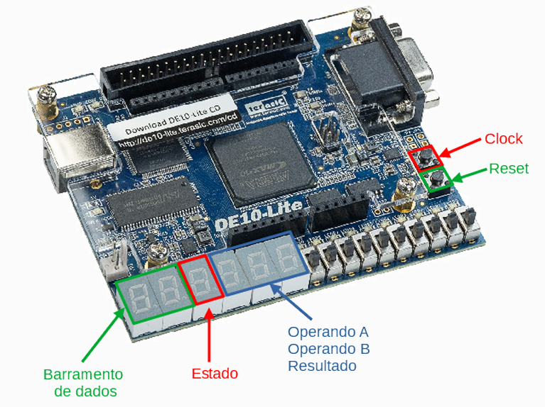
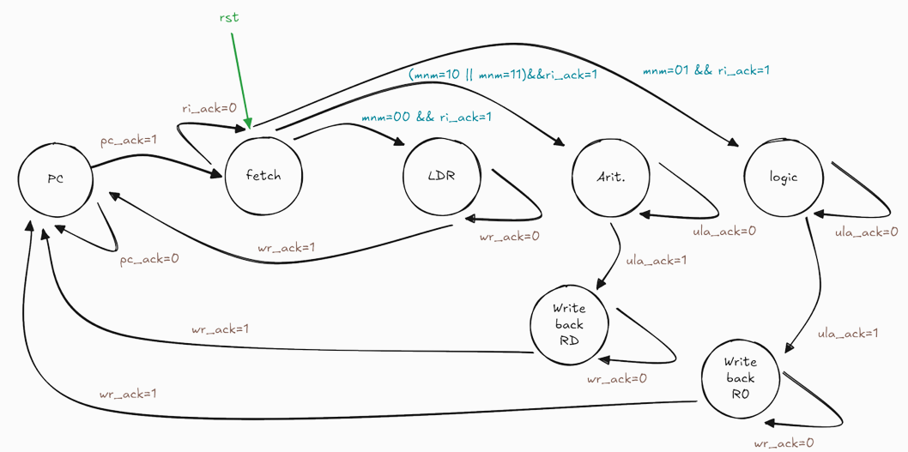
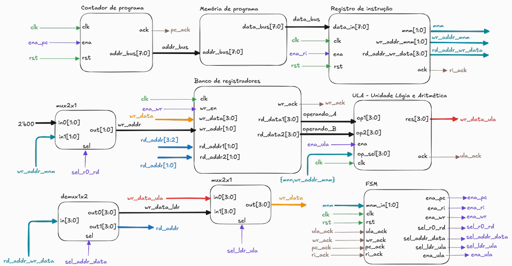

# MicroCore - Educational 4-bit Microarchitecture

**MicroCore** is a multi-cycle, educational 4-bit microarchitecture designed for the **DE10-Lite FPGA** board (Intel MAX 10). It implements a custom instruction set controlled by a Finite State Machine (FSM) to demonstrate fundamental concepts of computer architecture, such as instruction fetching, decoding, arithmetic/logic operations, and register manipulation. It's also the final project for the Digital Electronics 2 course (ELTD12A) at UNIFEI - Federal University of Itajubá.



## 📌 Features

- **4-bit Datapath**: Supports arithmetic and logic operations on 4-bit integers.
- **Multi-cycle Execution**: Instructions are executed in multiple clock cycles (Fetch, Decode, Execute, Write Back).
- **FSM Control Unit**: A robust Finite State Machine coordinates the datapath signals.
- **Visual Feedback**: Real-time visualization of the Data Bus, ALU Operands, Result, and FSM State using the DE10-Lite 7-segment displays.
- **Manual Clocking**: Step-by-step execution using the on-board push buttons for educational debugging.

## 📂 Repository Structure

```text
├── assets/          # Diagrams, FSM viewer images, and visual documentation
├── modules/         # Verilog source files (.v), Project Files (.qpf, .qsf) and ROM initialization file (Test Program)
├── pinouts/         # Pin assignment documentation
├── LICENSE          # MIT License
└── README.md        # Project documentation
```

## 🛠 Hardware & Requirements
- **Target Board:** Terasic DE10-Lite (Intel MAX 10 - 10M50DAF484C7G)

- **Software:** Intel Quartus Prime (Lite Edition recommended)

- **Language:** Verilog HDL (IEEE 1364-2001 compliance)

## ⚙️ Architecture
The system consists of a Program Counter (PC), a ROM for program storage, an Instruction Register (IR), a Register File (4x4-bit), and a Synchronous ALU.

### Instruction Set
The CPU supports the following instructions:

- **LDR:** Load immediate value into a register.

- **ADD / SUB:** Arithmetic operations.

- **AND / OR / XOR / NAND:** Bitwise logical operations.

### FSM Diagram
The control logic is governed by the following state machine:



### 🔄 FSM Logic Explanation

The Finite State Machine (FSM) acts as the control unit, cycling through 7 distinct states to execute instructions:

1.  **FETCH**: The system reads the instruction from ROM at the current PC address.
2.  **DECODE (Transitions)**: Based on the mnemonic bits (`mnm`), the FSM decides the next path:
    * `00` → **LDR** (Load Immediate)
    * `10` or `11` → **ARIT** (Arithmetic)
    * `01` → **LOGIC** (Logical Operations)
3.  **Execution States**:
    * **LDR**: Enables writing the immediate value directly into the target register.
    * **ARIT**: Selects operands from the Register File and enables the ALU for calculation.
    * **LOGIC**: Similar to ARIT, but sets up the ALU for logical operations (AND, OR, XOR, NAND).
4.  **Write Back States**:
    * **WB_RD**: Writes the ALU result into the destination register specified by the instruction.
    * **WB_R0**: Writes the logical operation result into register `R0` (fixed destination for logic ops).
5.  **PC**: Increments the Program Counter to point to the next instruction, restarting the cycle.

### 🧩 Module Integration

The **Module Integration** describes how independent hardware blocks interact to form the complete MicroCore processor. The `top_module.v` file connects these components via a central datapath:



### Data Flow Breakdown
1.  **Instruction Fetch**:
    - The **Program Counter (PC)** sends the current address (`addr_bus`) to the **ROM**.
    - The **ROM** outputs the 8-bit instruction (`data_bus`) to the **Instruction Register (IR)**.

2.  **Decoding & Routing**:
    - The **IR** splits the instruction into opcode (for the FSM) and operands.
    - A **Demux1x2** directs the lower 4 bits:
        - For `LDR` instructions: Sends immediate values to the Register File write data input.
        - For `ALU` instructions: Sends register addresses to the Register File read ports.

3.  **Execution & Storage**:
    - The **Register File** outputs two 4-bit values (`operando_A`, `operando_B`) to the **ALU**.
    - The **ALU** processes these values based on the operation selector and outputs the `result`.
    - A **Mux2x1** selects the final data source (Immediate value or ALU Result) to be written back into the Register File.

4.  **Control Plane**:
    - The **FSM** orchestrates this entire flow. It monitors `ack` (handshake) signals and asserts enable signals (`ena_pc`, `ena_wr`, `ena_ula`) to ensure data moves through the pipeline at the correct clock cycles.

## 🚀 How to Run

1.  Clone this repository:
    ```bash
    git clone https://github.com/davipeterson/microcore-4bits.git
    ```
2.  Open the project in **Intel Quartus Prime** (open the `.qpf` file inside the `modules` folder).
3.  Ensure `rom.txt` is in the correct path relative to the simulation/synthesis context.
4.  The pin assignments should load automatically via the `.qsf` file. If not, make sure to import it from the `microcore.csv` file inside the `pinouts` folder.
5.  Compile the design (`Start Compilation`).
6.  Program the FPGA using the **USB-Blaster**.

## 🎮 Board Controls & Visualization

After programming the board, use the following interface:

### Inputs
| Component | Function | Description |
| :--- | :--- | :--- |
| **KEY[0]** | **Clock** | Manual clock pulse (Advance execution step) |
| **KEY[1]** | **Reset** | Global Reset (Active High internally, button is inverted) |

### Outputs (7-Segment Displays)
| Display | Signal | Description |
| :--- | :--- | :--- |
| **HEX5** | `data_bus[7:4]` | Data Bus (MSB) |
| **HEX4** | `data_bus[3:0]` | Data Bus (LSB) |
| **HEX3** | `state` | Current FSM State ID |
| **HEX2** | `operando_A` | ALU Operand A |
| **HEX1** | `operando_B` | ALU Operand B |
| **HEX0** | `result` | ALU Result / Write Data |

### FSM State Codes (Displayed on HEX3)
- **0**: PC Update
- **1**: Fetch
- **2**: LDR (Load)
- **3**: ARIT (Arithmetic Setup)
- **4**: WB_RD (Write Back to RD)
- **5**: LOGIC (Logic Setup)
- **6**: WB_R0 (Write Back to R0)

## 🧪 Test Program (ROM)

The included `rom.txt` executes a validation sequence required for the project assessment:

1.  **LDR R1, 4** (Load 4 into R1)
2.  **LDR R2, 1** (Load 1 into R2)
3.  **ADD R3, R1, R2** (R3 = 4 + 1 = 5)
4.  **AND R0, R1, R2** (Logic AND)
5.  **OR R0, R1, R2** (Logic OR)
6.  **NAND R0, R1, R2** (Logic NAND)
7.  **XOR R0, R1, R2** (Logic XOR)
8.  **SUB R3, R1, R2** (R3 = 4 - 1 = 3)

## 📄 License

This project is licensed under the MIT License - see the [LICENSE](LICENSE) file for details.

---
**Authors**: Davi Peterson, Nicole Micheletti  
**Institution**: UNIFEI
